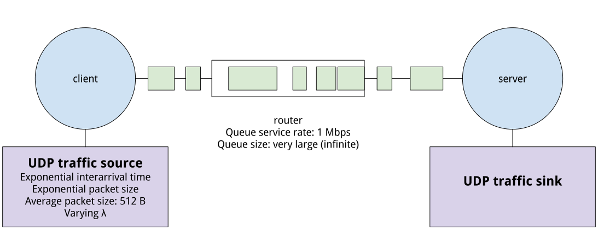

## Validating the M/M/1 queue result

In this experiment, you will explore the classic result regarding the queue length of the M/M/1 queue with a series of experiments on a testbed platform and with the ns2 simulator.

After completing this lab assignment, you should:

-   Know how to run a basic queuing experiment on an experimental research testbed
-   Be able to use `tc` to manipulate queues on Linux
-   Be able to use the D-ITG traffic generator to generate traffic with specific properties on Linux
-   Know how to run a basic queuing experiment in ns2
-   Understand how to "sanity-check" an experiment to verify that it is a valid experiment
-   Compare analytical, simulation, and testbed experiment results for the average length of the M/M/1 queue

To run this experiment on FABRIC, sign in to the [FABRIC portal](https://portal.fabric-testbed.net/). Then, click on JupyterHub and sign in to the FABRIC JupyterHub instance.

In the Jupyter environment, open a terminal (File \> New \> Terminal) and run

    git clone https://github.com/teaching-on-testbeds/mm1-methods

Use the file browser in the left sidebar of the Jupyter environment to find the `mm1-methods` directory (you may need to click the refresh icon in the file browser, or wait a few moments, before it is visible). Double click on this directory, then on the `start_fabric.ipynb` file to open this notebook.

### Background

In this experiment, you're going to measure the average queue length in the following scenario:



We know that the mean number of packets in this system is given by ρ/(1−ρ), where ρ=λ/μ and λ and μ are the rate at which packets arrive at the queue (in packets/second) and the rate at which packets may be served by the queue (in packets/second).

In our experiment, the distribution of μ comes from variations in the size of packets arriving at the queue, which has a constant service rate in bits/second - μ is computed by dividing the queue service rate in bits/second by the average packet size in bits.

From the mean number of packets in the system, we can compute the mean number of packets in the queue by substracting the mean number of packets in service: \[ρ/(1−ρ)\]−ρ=ρ²/(1−ρ)

This mean queue length is the quantity we will be measuring in this experiment.

### Configure environment

``` python
from fabrictestbed_extensions.fablib.fablib import FablibManager as fablib_manager
fablib = fablib_manager() 
conf = fablib.show_config()
```

### Define configuration for this experiment (two hosts and router in line topology)

``` python
slice_name="mm1-" + fablib.get_bastion_username()

node_conf = [
 {'name': "romeo",   'cores': 2, 'ram': 4, 'disk': 10, 'image': 'default_ubuntu_22', 'packages': ['d-itg', 'ns2']}, 
 {'name': "juliet",  'cores': 2, 'ram': 4, 'disk': 10, 'image': 'default_ubuntu_22', 'packages': ['d-itg']}, 
 {'name': "router",  'cores': 2, 'ram': 4, 'disk': 10, 'image': 'default_ubuntu_22', 'packages': ['tshark']}
]
net_conf = [
 {"name": "net1", "subnet": "10.0.1.0/24", "nodes": [{"name": "romeo",   "addr": "10.0.1.100"}, {"name": "router", "addr": "10.0.1.10"}]},
 {"name": "net2", "subnet": "10.0.2.0/24", "nodes": [{"name": "juliet",  "addr": "10.0.2.100"}, {"name": "router", "addr": "10.0.2.10"}]}
]
route_conf = [
 {"addr": "10.0.2.0/24", "gw": "10.0.0.10", "nodes": ["romeo"]},
 {"addr": "10.0.1.0/24", "gw": "10.0.1.10", "nodes": ["juliet"]}
]
exp_conf = {'cores': sum([ n['cores'] for n in node_conf]), 'nic': sum([len(n['nodes']) for n in net_conf]) }
```

### Reserve resources

Now, we are ready to reserve resources!

First, make sure you don't already have a slice with this name:

``` python
try:
    slice = fablib.get_slice(slice_name)
    print("You already have a slice by this name!")
    print("If you previously reserved resources, skip to the 'log in to resources' section.")
except:
    print("You don't have a slice named %s yet." % slice_name)
    print("Continue to the next step to make one.")
    slice = fablib.new_slice(name=slice_name)
```

We will select a random site that has sufficient resources for our experiment:

``` python
while True:
    site_name = fablib.get_random_site()
    if ( (fablib.resources.get_core_available(site_name) > 1.2*exp_conf['cores']) and
        (fablib.resources.get_component_available(site_name, 'SharedNIC-ConnectX-6') > 1.2**exp_conf['nic']) ):
        break

fablib.show_site(site_name)
```

Then we will add hosts and network segments:

``` python
# this cell sets up the nodes
for n in node_conf:
    slice.add_node(name=n['name'], site=site_name, 
                   cores=n['cores'], 
                   ram=n['ram'], 
                   disk=n['disk'], 
                   image=n['image'])
```

``` python
# this cell sets up the network segments
for n in net_conf:
    ifaces = [slice.get_node(node["name"]).add_component(model="NIC_Basic", 
                                                 name=n["name"]).get_interfaces()[0] for node in n['nodes'] ]
    slice.add_l2network(name=n["name"], type='L2Bridge', interfaces=ifaces)
```

The following cell submits our request to the FABRIC site. The output of this cell will update automatically as the status of our request changes.

-   While it is being prepared, the "State" of the slice will appear as "Configuring".
-   When it is ready, the "State" of the slice will change to "StableOK".

You may prefer to walk away and come back in a few minutes (for simple slices) or a few tens of minutes (for more complicated slices with many resources).

``` python
slice.submit()
```

``` python
slice.get_state()
slice.wait_ssh(progress=True)
```

### Extend your slice

If you don't plan to finish an experiment in one day, you can extend your slice. The following cell extends your reservation for 7 days.

``` python
from datetime import datetime
from datetime import timezone
from datetime import timedelta

# Set end date to 7 days from now
end_date = (datetime.now(timezone.utc) + timedelta(days=7)).strftime("%Y-%m-%d %H:%M:%S %z")
slice.renew(end_date)
```

### Configure resources

Next, we will configure the resources so they are ready to use.

``` python
slice = fablib.get_slice(name=slice_name)
```

``` python
# install packages
# this will take a while and will run in background while you do other steps
for n in node_conf:
    if len(n['packages']):
        node = slice.get_node(n['name'])
        pkg = " ".join(n['packages'])
        node.execute_thread("sudo apt update; sudo apt -y install %s" % pkg)
```

``` python
# bring interfaces up and either assign an address (if there is one) or flush address
from ipaddress import ip_address, IPv4Address, IPv4Network

for net in net_conf:
    for n in net['nodes']:
        if_name = n['name'] + '-' + net['name'] + '-p1'
        iface = slice.get_interface(if_name)
        iface.ip_link_up()
        if n['addr']:
            iface.ip_addr_add(addr=n['addr'], subnet=IPv4Network(net['subnet']))
        else:
            iface.get_node().execute("sudo ip addr flush dev %s"  % iface.get_device_name())
```

``` python
# prepare a "hosts" file that has names and addresses of every node
hosts_txt = [ "%s\t%s" % ( n['addr'], n['name'] ) for net in net_conf  for n in net['nodes'] if type(n) is dict and n['addr']]
for n in slice.get_nodes():
    for h in hosts_txt:
        n.execute("echo %s | sudo tee -a /etc/hosts" % h)
```

``` python
# enable IPv4 forwarding on all nodes
for n in slice.get_nodes():
    n.execute("sudo sysctl -w net.ipv4.ip_forward=1")
```

``` python
# set up static routes
for rt in route_conf:
    for n in rt['nodes']:
        slice.get_node(name=n).ip_route_add(subnet=IPv4Network(rt['addr']), gateway=rt['gw'])
```

### Draw the network topology

The following cell will draw the network topology, for your reference. The interface name and addresses of each experiment interface will be shown on the drawing.

``` python
l2_nets = [(n.get_name(), {'color': 'lavender'}) for n in slice.get_l2networks() ]
l3_nets = [(n.get_name(), {'color': 'pink'}) for n in slice.get_l3networks() ]
hosts   =   [(n.get_name(), {'color': 'lightblue'}) for n in slice.get_nodes()]
nodes = l2_nets + l3_nets + hosts
ifaces = [iface.toDict() for iface in slice.get_interfaces()]
edges = [(iface['network'], iface['node'], 
          {'label': iface['physical_dev'] + '\n' + iface['ip_addr'] + '\n' + iface['mac']}) for iface in ifaces]
```

``` python
import networkx as nx
import matplotlib.pyplot as plt
plt.figure(figsize=(len(nodes),len(nodes)))
G = nx.Graph()
G.add_nodes_from(nodes)
G.add_edges_from(edges)
pos = nx.spring_layout(G)
nx.draw(G, pos, node_shape='s',  
        node_color=[n[1]['color'] for n in nodes], 
        node_size=[len(n[0])*400 for n in nodes],  
        with_labels=True);
nx.draw_networkx_edge_labels(G,pos,
                             edge_labels=nx.get_edge_attributes(G,'label'),
                             font_color='gray',  font_size=8, rotate=False);
```

### Log into resources

Now, we are finally ready to log in to our resources over SSH! Run the following cells, and observe the table output - you will see an SSH command for each of the resources in your topology.

``` python
import pandas as pd
pd.set_option('display.max_colwidth', None)
slice_info = [{'Name': n.get_name(), 'SSH command': n.get_ssh_command()} for n in slice.get_nodes()]
pd.DataFrame(slice_info).set_index('Name')
```

Now, you can open an SSH session on any of the resources as follows:

-   in Jupyter, from the menu bar, use File \> New \> Terminal to open a new terminal.
-   copy an SSH command from the table, and paste it into the terminal. (Note that each SSH command is a single line, even if the display wraps the text to a second line! When you copy and paste it, paste it all together.)

You can repeat this process (open several terminals) to start a session on each resource. Each terminal session will have a tab in the Jupyter environment, so that you can easily switch between them.

### Simulation on ns2

We will start with a simulation experiment, using the ns2 simulator. This experiment highlights the following aspects of network research using simulation:

-   "Hidden" default settings in a simulation platform may cause our experiment assumptions to be violated, affecting the validity of the results.
-   Validating experiment assumptions is an important "sanity check" to catch some problems in the experiment.
-   To run a valid stochastic experiment, we need to understand sources of randomness in our experiment and how to generate random results.

``` python
# run this cell to "pick up" where you left off in a new session
from fabrictestbed_extensions.fablib.fablib import FablibManager as fablib_manager
fablib = fablib_manager() 
slice_name="mm1-" + fablib.get_bastion_username()
slice = fablib.get_slice(name=slice_name)
```

In this experiment, you'll set up a basic M/M/1 queue on ns2. You won't have to develop an ns2 simulation from scratch, but you will need to understand a little bit about how it works, and modify an existing simulation. To help you, please refer to:

-   Chapter 2 of these [ns2 lecture notes](https://www-sop.inria.fr/members/Eitan.Altman/COURS-NS/n3.pdf), "ns Simulator Preliminaries"
-   Chapter 10 of these [ns2 lecture notes](https://www-sop.inria.fr/members/Eitan.Altman/COURS-NS/n3.pdf), "Classical queuing models". This chapter includes a script for a simulation of an M/M/1 queue, which we're going to use as the base for our simulation.

The "romeo" node in this experiment should already have ns2 installed. Log into that node now, using the SSH login details shown earlier.

To run an ns2 simulation, we simply run

    ns SIMULATION.tcl

where `SIMULATION.tcl` is the name of the simulation script we want to run. These are written in the tcl scripting language.

To get a feel for this, we'll start by running a simulation right away. First, transfer the simulation file to "romeo" by running the following cell:

``` python
slice.get_node("romeo").upload_file("mm1.tcl", "/home/ubuntu/mm1.tcl")
```

Then, in the SSH session on romeo, run

    ls

and verify that you can see the file. If you can see it, run it with

    ns mm1.tcl

This script produces two output files: "out.tr" and "qm.out". The "out.tr" file is known as a "trace file," and its format is described [here](https://www.isi.edu/nsnam/ns/doc/node289.html). (Chapter 3 of the [ns2 lecture notes](https://www-sop.inria.fr/members/Eitan.Altman/COURS-NS/n3.pdf) also describes how to process trace files using standard Linux tools like `awk` and `grep`.)

The "qm.out" file is a trace file that specifically monitors the queue. Its columns are:

1.  Time,
2.  From node,
3.  To node,
4.  Queue size (B),
5.  Queue size (packets),
6.  Arrivals (packets),
7.  Departures (packets),
8.  Drops (packets),
9.  Arrivals (bytes),
10. Departures (bytes),
11. Drops (bytes)

We can use `awk` to compute the average value of the fifth column (queue size in packets) directly on the romeo host - run

    cat qm.out | awk  '{ sum += $5 } END { if (NR > 0) print sum / NR }' 

to see the mean queue size for the experiment we just ran.

Having run the experiment with its default paramaters, now we will modify the values in the script to match a specific scenario - 1 Mbps bottleneck link, exponentially distributed packet size with 512 B average, and exponentially distributed interarrival time with mean arrival rate 200 packets/second. (Later, we will run a testbed experiment with the same parameters).

In the file browser in the Jupyter environment, find the `mm1.tcl` file, and double click to open it for editing. Then then make the following changes:

-   queue service rate should be 1 Mbps - in the line `set link [$ns simplex-link $n1 $n2 100kb 0ms DropTail]`, change `100kb` to `1Mb`
-   average packet size should be 512 Bytes - modify two lines: change the numerator in `$pktSize set avg_ [expr 100000.0/(8*$mu)]` to the new link rate, `1000000.0`, and change the value in `set mu 33.0` from `33.0` to `244.14`.
-   set the rate at which packets arrive to 200 packets per second - modify the line `set lambda 30.0` and change the value from `30.0` to `200.0`.

Then, save the modified file, repeat the steps above (starting from transferring the file to the romeo host), and compute the mean queue length.

Compare the value measured by your simulation experiment with the value predicted by the analytical model.

The analytical model tells us about the behavior of the queue as ρ varies. We will attempt to confirm this by simulation - we will vary ρ and measure the effect on mean queue occupancy.

To make it easier to run, we will modify the script so that `lambda` is passed as a command line argument. Open the script using the file browser again, and change the `set lambda` line to read

    set lambda [lindex $argv 0] 

Then, you will run the script with a single argument - the value of λ, such as

    ns mm1.tcl 200.0

Save the modified `mm1.tcl`, and update this file on the romeo host:

``` python
slice.get_node("romeo").upload_file("mm1.tcl", "/home/ubuntu/mm1.tcl")
```

We're going to systematically run the `ns2` script and find the mean value of queue occupancy for the following values of λ: 225.0, 200.0, 175.0, 150.0, 125.0. Use the following cell to run these simulations:

``` python
lambda_vals = [225.0, 200.0, 175.0, 150.0, 125.0]
q_avg_vals = []
for l in lambda_vals:
    print(f"Now running experiment for lambda = {l}")
    slice.get_node("romeo").execute(f"ns mm1.tcl {l}")
    q_avg = slice.get_node("romeo").execute("cat qm.out | awk  '{ sum += $5 } END { if (NR > 0) print sum / NR }' ")
    q_avg_vals.append(q_avg)
```

Then, we'll compile the simulation results and compare to the predictions of the analytical model in a table:

``` python
import pandas as pd
import numpy as np
df = pd.DataFrame.from_dict({'rho': np.array(lambda_vals)/244.14,
                             'q_avg_sim': [float(q[0].strip()) for q in q_avg_vals]})
df = df.assign(q_avg_ana = df.rho*df.rho/(1-df.rho) )
df
```

We can see that the simulation consistently finds a smaller queue size than the analytical model. Let's visualize this -

-   in a single plot, we'll put ρ on the x-axis, and mean queue occupancy on the y-axis.
-   we'll the y-axis a log10 scale.
-   we'll plot each of the six simulation results as a point, and plot the prediction of the analytical model as a line.

``` python
import matplotlib.pyplot as plt
_ = plt.scatter(df.rho, df.q_avg_sim, label="Simulation")
_ = plt.plot(df.rho, df.q_avg_ana, label="Analytical")
_ = plt.legend()
_ = plt.xlabel("ρ")
_ = plt.ylabel("Mean queue length (packets)")
```

If our simulation results were sometimes a bit bigger than the analytical prediction and sometimes a big smaller, we might attribute it to the stochastic nature of the experiment - the random variation of the packet sizes and interarrival times.

If this was the case, then by running the experiment for a longer duration, the effect of randomness should be smoothed out and the difference between analytical and simulation results should be smaller. Try this - in the `mm1.tcl` script, make the experiment 10x longer:

-   change `$ns at 1000.0 "finish"` to `$ns at 10000.0 "finish"`

Then, repeat the file transfer, experiment execution, and data analysis and plotting:

``` python
slice.get_node("romeo").upload_file("mm1.tcl", "/home/ubuntu/mm1.tcl")
```

``` python
lambda_vals = [225.0, 200.0, 175.0, 150.0, 125.0]
q_avg_vals = []
for l in lambda_vals:
    print(f"Now running experiment for lambda = {l}")
    slice.get_node("romeo").execute(f"ns mm1.tcl {l}")
    q_avg = slice.get_node("romeo").execute("cat qm.out | awk  '{ sum += $5 } END { if (NR > 0) print sum / NR }' ")
    q_avg_vals.append(q_avg)
```

``` python
df = pd.DataFrame.from_dict({'rho': np.array(lambda_vals)/244.14,
                             'q_avg_sim': [float(q[0].strip()) for q in q_avg_vals]})
df = df.assign(q_avg_ana = df.rho*df.rho/(1-df.rho) )
df
```

``` python
_ = plt.scatter(df.rho, df.q_avg_sim, label="Simulation")
_ = plt.plot(df.rho, df.q_avg_ana, label="Analytical")
_ = plt.legend()
_ = plt.xlabel("ρ")
_ = plt.ylabel("Mean queue length (packets)")
```

Since the trend persists (and also, since it is systematic in one direction!) we cannot attribute it to the randomness in the experiment.

In our first experiment (with μ=244.14, λ=200), we assume that:

-   The packet sizes are exponentially distributed with mean size 512 bytes, so that the mean service rate at the router is exponentially distributed with mean 244.1 packets/second.
-   The traffic is Poisson with λ = 200 packets/second (at least, for the initial experiment).
-   The queue capacity is effectively infinite (i.e. no packets are dropped).

Now, we will try and validate how well these assumptions are realized in our experiments.

On the "romeo" host, run

    ns mm1.tcl 200.0

to generate a trace file for this experiment.

Then, from the trace file, extract the timestamp and size of each received packet by running the following on the "romeo" host:

    cat out.tr | grep "r" | cut -f2,6 -d' ' > packets.dat

Transfer this "packets.dat" to your laptop by running the following cell:

``` python
slice.get_node("romeo").download_file("packets.dat", "/home/ubuntu/packets.dat")
```

Then, we'll create a plot showing the distribution of packets sizes compared to the expected distribution, as follows:

-   we'll put "Packet size in bytes" on the x-axis
-   we'll put "Number of packets of this size observed" on the y-axis
-   we'll use a log scale for the y-axis, and a range of 0 to 2500 B on the x-axis
-   On top of this plot, draw a line showing the number of packets of each size that you expect to observe if packet sizes are exponentially distributed with mean 512 B.

``` python
df = pd.read_table("packets.dat", sep=" ", names=["time", "size"])
_ = plt.hist(df.size_B, bins = np.arange(0, 2500, 10))
_ = plt.xlabel("Packet size (B)")
_ = plt.ylabel("Number of packets of this size observed")
_ = plt.yscale('log')
```

Also, compute the mean packet size:

``` python
df.size_B.mean()
```

You should have noticed that the distribution is truncated at the top end! Also, the mean packet size is much lower than we had expected.

The [ns2 lecture notes](https://www-sop.inria.fr/members/Eitan.Altman/COURS-NS/n3.pdf) explain the reason - a secret default value in the simulation platform! - and how to fix it:

> The simulated packets turn out to be truncated at the value of 1kbyte, which is the default size of a UDP packet. Thus transmission times are a little shorter than we intend them to be. To correct that, one should change the default maximum packet size, for example to 100000. This is done by adding the line
>
>     $src set packetSize_ 100000
>
> after the command `set src [new Agent/UDP]`.

Make this change to the simulation script `mm1.tcl`, then upload it to "romeo":

``` python
slice.get_node("romeo").upload_file("mm1.tcl", "/home/ubuntu/mm1.tcl")
```

Repeat the experiment with this "hidden default" changed - on the "romeo" host, run

    ns mm1.tcl 200.0

to generate a trace file for this experiment.

Then, from the trace file, extract the timestamp and size of each received packet by running the following on the "romeo" host:

    cat out.tr | grep "r" | cut -f2,6 -d' ' > packets.dat

Transfer this "packets.dat" to your laptop by running the following cell:

``` python
slice.get_node("romeo").download_file("packets.dat", "/home/ubuntu/packets.dat")
```

and again, plot the distribution of packet size and compute the mean packet size:

``` python
df = pd.read_table("packets.dat", sep=" ", names=["time", "size"])
_ = plt.hist(df.size_B, bins = np.arange(0, 2500, 10))
_ = plt.xlabel("Packet size (B)")
_ = plt.ylabel("Number of packets of this size observed")
_ = plt.yscale('log')
```

``` python
df.size_B.mean()
```

This time, you should see a packet size distribution that is consistent with our assumption!

Next, we will consider the packet interarrival time for our simulation experiment. We expect a mean interarrival time of 0.005 second (1/200 packets/second). Let's the observed mean interarrival time using the timestamps of received packets in the output file - how close is it to 0.005 seconds?

``` python
df.time.diff().mean()
```

We'll also create a plot showing the expected and observed distribution of interarrival times - we will:

-   Find out the frequency of each interarrival time in the trace in 0.001 second bins.
-   Plot these frequencies: put "Interarrival time in seconds" on the x-axis and "Number of times a value in this bin was observed" on the y-axis.
-   Use a log10 scale for the y-axis, and a range of 0 to 0.1 seconds on the x-axis.

``` python
_ = plt.hist(df.time.diff(), bins = np.arange(0, 0.1, 0.001))
_ = plt.xlabel("Interarrival time")
_ = plt.ylabel("Number of interarrivals of this duration observed")
_ = plt.yscale('log')
```

We should see that the mean interarrival time is similar to our expectation. The distribution is also consistent with our expectations, although for events that occur infrequently (e.g. very small interarrival times) we would need a longer experiment duration to get a "smooth" curve.

Third, we will validate the assumption that the queue size is effectively infinite - at least, for this experiment. Check the last line of the queue monitor output file, and see if any packets are reported as being dropped (8th column in the "qm.out" file):

\_ = slice.get_node("romeo").execute("tail -n 1 qm.out")

Finally, now that our assumptions are validated, we want to be able to run multiple trials as independent random experiments.

On the "romeo" host, run the script a few times, and look at the trace files each time:

    ns mm1.tcl 200.0
    head -n 20 out.tr

These are not independent trials - the interarrival times and packet sizes are identical on each run.

To get statistically independent trials, we will need to seed the random number generator with a different value each time we run the experiment. Also, we will want to set up the two distributions in the experiment (packet interarrival time and packet size) to be statistically independent, using different substreams of the random number generator.

To do this, add a few lines to `mm1.tcl` immediately after `set ns [new Simulator]`:

    set rep [lindex $argv 1]

    set rng1 [new RNG]
    set rng2 [new RNG]

    for {set i 1} {$i<$rep} {incr i} {
            $rng1 next-substream;
            $rng2 next-substream
    }

The first line says to take a *second* argument from the command line and store it in the variable "rep". (Recall that we are already passing `lambda` as the first command line argument.) We then create two random number generator objects. Then, we explicitly set them to use different random substreams of the ns2 random number generator, using `next-substream`. We use the "rep" value passed from the command line to determine how many times to call `next-substream`, so that simulations run with different values of "rep" will have different random numbers.

We still need to assign the random number generator objects to the distributions that they will feed. Underneath the line

    set InterArrivalTime [new RandomVariable/Exponential]

add

    $InterArrivalTime use-rng $rng1

and underneath

    set pktSize [new RandomVariable/Exponential]

add

    $pktSize use-rng $rng2

Save `mm1.tcl` and transfer it to "romeo":

``` python
slice.get_node("romeo").upload_file("mm1.tcl", "/home/ubuntu/mm1.tcl")
```

Now, you will run your simulation with another argument, e.g.

    ns mm1.tcl 200.0 1

where independent results will be generated when you supply different values for the second argument.

On "romeo", run your script with different values of "rep" - try all the integer values in the range 1-5 - and look at the trace file each time:

    ns mm1.tcl 200.0 1
    head -n 20 out.tr

Verify that different values of "rep" give different random values.

Note: ns2 uses a multiple recursive generator called MRG32k3a, which contains streams from which numbers picked sequentially seem to be random, uniformly distributed. These in turn are transformed to create variates of other desired distributions. More information about the current random number generator in ns2 is available [here](http://www.isi.edu/nsnam/ns/doc/node267.html).

Now that we have validated our experiment settings (and made changes where necessary!), and we can run independent random experiments, let us repeat the experiment.

This will take a while, since we are going to run five experiments for each value of λ! You can run all three cells in order (without waiting for the first to complete before running the next one), step away, and come back later to see the results.

``` python
lambda_vals = [225.0, 200.0, 175.0, 150.0, 125.0]
seeds = [1,2,3,4,5]
q_avg_vals = np.zeros(shape=(len(lambda_vals), len(seeds)))
for i, l in enumerate(lambda_vals):
    for j, s in enumerate(seeds):
        print(f"Now running experiment {s} for lambda = {l}")
        slice.get_node("romeo").execute(f"ns mm1.tcl {l} {s}")
        q_avg = slice.get_node("romeo").execute("cat qm.out | awk  '{ sum += $5 } END { if (NR > 0) print sum / NR }' ")
        q_avg_float = float(q_avg[0].strip())
        q_avg_vals[i, j] = q_avg_float
```

``` python
df = pd.DataFrame.from_dict({'rho': np.array(lambda_vals)/244.14,
                             'q_avg_sim': [float(q[0].strip()) for q in q_avg_vals]})
df = df.assign(q_avg_ana = df.rho*df.rho/(1-df.rho) )
df
```

``` python
_ = plt.scatter(df.rho, df.q_avg_sim, label="Simulation")
_ = plt.plot(df.rho, df.q_avg_ana, label="Analytical")
_ = plt.legend()
_ = plt.xlabel("ρ")
_ = plt.ylabel("Mean queue length (packets)")
```

This time, our simulation results are much closer to the predictions of the analytical model - and, we do not see any *systematic* difference in the results.

### Delete your slice

When you finish your experiment, you should delete your slice! The following cells deletes all the resources in your slice, freeing them for other experimenters.

``` python
slice = fablib.get_slice(name=slice_name)
fablib.delete_slice(slice_name)
```

``` python
# slice should end up in "Dead" state
# re-run this cell until you see it in "Dead" state
slice.update()
_ = slice.show()
```
